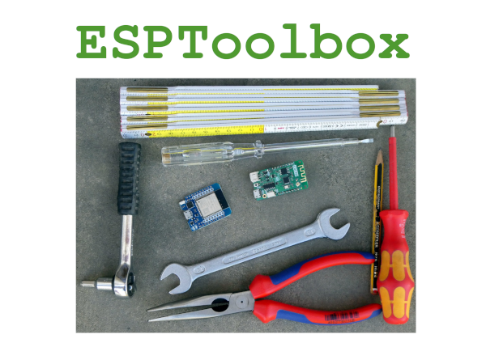

# ESPToolbox

Facilitate your programming by using this toolbox for ESP32 and ESP8266.

## Some infos

I work often with both microcontroller from Espressif, the ESP8266 and the ESP32. I'm a forgetful man, and often search quite a long time to find back pieces of code already written and used in my projects. So I wrote an Arduino library to hold all those pieces of code and named it `ESPToolbox`. The code is intended to work on ESP8266 and ESP32, and to help coding quicker with shorter and clearer code.

This toolbox contains methods to:

+ log and debug with LEDs, Serial or over UDP
+ work with LEDs
+ use WiFi and to get a static IP address
+ use Over The Air programming (OTA)
+ get the time from an Network Time Protocol (NTP)
+ easily use millis() instead of delay()

And an example to use everything together with MQTT and a temerature, humidity and pressure sensor (BME280).

The Toolbox has already proved its usefulness and reliability in my last projects like:

+ [SmartyReader&#reg;](https://www.weigu.lu/microcontroller/smartyReader_P1/index.html)
+ [Neo Clock 2](https://www.weigu.lu/microcontroller/neo_clock_2/index.html)
+ [Garden watering](https://www.weigu.lu/microcontroller/garden_watering/index.html)

The Toolbox is completely documented here: <http://www.weigu.lu/microcontroller/esptoolbox/index.html>

## All infos: <http://www.weigu.lu/microcontroller/esptoolbox/index.html>